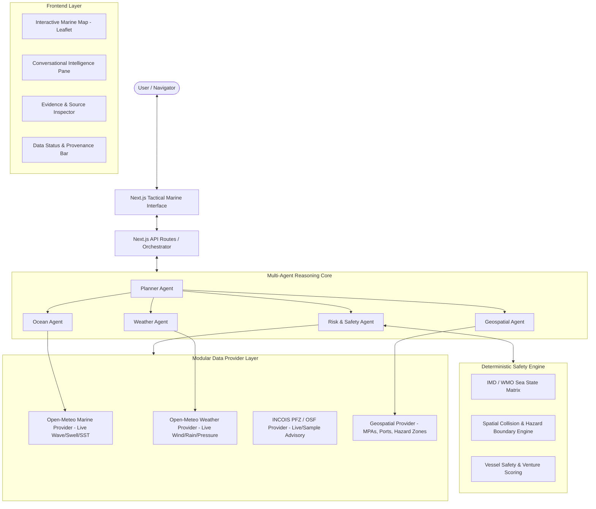

# Implementation Plan: ORCA — Marine EcOsystem Reasoning with Collaborative Agents

ORCA is an AI-powered marine intelligence, safety, and decision-support platform. It assists fishermen, maritime operators, coastal authorities, and researchers with real-time ocean state forecasting, Potential Fishing Zone (PFZ) insights, hazard detection, geofence compliance, and navigational risk assessment.

This implementation plan outlines the architecture, data provider strategy, safety rules, and a **7-day roadmap** for an end-to-end working MVP that adheres to strict reliability standards (no hallucinated marine safety data, full provenance tracking, and deterministic risk reasoning).

---

## 1. System Architecture & High-Level Design



---

## 2. Core Architectural Principles & Safety Standards

1. **Deterministic Safety (Rule 9 & Rule 7)**:
   - AI language models will **never** invent or estimate wave heights, wind speeds, or hazard zones.
   - All safety ratings (e.g., `SAFE`, `CAUTION`, `HAZARDOUS`, `PROHIBITED`) are calculated by a pure, testable TypeScript **Deterministic Risk Engine** based on World Meteorological Organization (WMO) and Indian Meteorological Department (IMD) sea state tables.
   - The LLM acts as an explanatory synthesizer that consumes verified facts and the Risk Engine's output, grounding every answer in evidence.

2. **Strict Provenance & Status Tagging (Rule 6 & Rule 8)**:
   - Every single observation metric implements the `MarineMetric<T>` interface:
     ```typescript
     export type DataStatus = 'LIVE' | 'DELAYED' | 'DEMO' | 'UNAVAILABLE';
     
     export interface MarineMetric<T> {
       value: T | null;
       unit: string;
       timestamp: string; // ISO 8601
       source: string;    // e.g. "Open-Meteo Marine (Copernicus / ECMWF)"
       status: DataStatus;
       confidence?: number;
     }
     ```
   - If an API returns no data, it produces `{ status: 'UNAVAILABLE', value: null }` and displays `DATA_UNAVAILABLE` rather than fallback guessing.

3. **Modular Provider Pattern (Rule 3 & Rule 10)**:
   - Data fetching is strictly decoupled through interfaces (`IMarineDataProvider`, `IWeatherDataProvider`, `IPfzDataProvider`, `IGeofenceDataProvider`).
   - Adding a new provider (e.g. INCOIS live API, NOAA, or Copernicus Marine Store) requires implementing one interface without changing any agent or UI logic.

4. **Zero Frontend Secret Leaks (Rule 4 & Rule 5)**:
   - All external API calls and AI model keys reside exclusively in Next.js Server Components and Server API Routes (`/api/marine/*`, `/api/chat`, `/api/risk`).

---

## 3. Technology Stack Decisions

| Layer | Selected Tech | Rationale |
| :--- | :--- | :--- |
| **Framework** | Next.js 14/15 (App Router, TypeScript) | Server-side security, API routes, fast SSR, standard deployment on Vercel |
| **Styling & UI** | Tailwind CSS + Lucide Icons + Radix UI Primitives | Clean dark-mode ocean/tactical aesthetic, responsive split-screen |
| **Mapping Engine** | Leaflet + React-Leaflet | Lightweight, rock-solid marine GeoJSON layers, vector markers, ocean bathymetry tiles |
| **AI / Orchestrator** | Google Gemini API (via `@google/genai` or Vercel AI SDK) | Fast structured tool calling, reasoning, and JSON schema outputs |
| **Spatial Engine** | Turf.js (`@turf/turf`) | Point-in-polygon, distance to port/hazard, geofence collision detection |
| **Data Providers** | Open-Meteo Marine + Open-Meteo Weather + INCOIS PFZ Provider | Free, verified, real-world live APIs with zero key requirements for MVP |

---

## 4. Proposed Folder Structure

```
c:/Users/Lenovo/OneDrive/Desktop/ORCA/
├── src/
│   ├── app/
│   │   ├── api/
│   │   │   ├── chat/route.ts            # Planner Agent orchestrator endpoint
│   │   │   ├── ocean/route.ts           # Marine data server proxy
│   │   │   ├── weather/route.ts         # Weather data server proxy
│   │   │   └── pfz/route.ts             # Potential Fishing Zone GeoJSON & advisories
│   │   ├── globals.css                  # Marine dark-mode theme & animations
│   │   ├── layout.tsx                   # Root layout with metadata
│   │   └── page.tsx                     # Main tactical dashboard (Split: Map + AI Agent)
│   ├── components/
│   │   ├── map/
│   │   │   ├── MarineMap.tsx            # Dynamic Leaflet map container
│   │   │   ├── MapLayers.tsx            # PFZ, Wind/Wave arrows, Hazard overlays
│   │   │   ├── CoordinatesPicker.tsx    # Click-to-inspect marine location
│   │   │   └── MapLegend.tsx            # Bathymetry & Hazard legend
│   │   ├── chat/
│   │   │   ├── ChatInterface.tsx        # Conversational agent UI
│   │   │   ├── MessageItem.tsx          # Message with evidence badges
│   │   │   ├── QuickQueries.tsx         # Suggested queries (PFZ, Sea venture safety)
│   │   │   └── EvidenceCard.tsx         # Collapsible raw telemetry & sources
│   │   ├── dashboard/
│   │   │   ├── OceanSummaryBar.tsx      # Current SST, Wave, Swell, Wind widgets
│   │   │   ├── RiskIndicator.tsx        # Hazard gauge & safety assessment badge
│   │   │   └── StatusProvenanceTag.tsx  # LIVE / DEMO / UNAVAILABLE badge
│   │   └── ui/                          # Button, Modal, Card, Tooltip primitives
│   ├── lib/
│   │   ├── agents/
│   │   │   ├── plannerAgent.ts          # Intent decomposition & coordinator
│   │   │   ├── weatherAgent.ts          # Wind, precipitation, pressure specialist
│   │   │   ├── oceanAgent.ts            # Waves, swell, SST, current specialist
│   │   │   ├── geospatialAgent.ts       # Distance to port, geofencing, PFZ matching
│   │   │   └── riskAgent.ts             # Risk reasoning wrapper over deterministic engine
│   │   ├── risk-engine/
│   │   │   ├── safetyRules.ts           # IMD/WMO sea state criteria & Beaufort rules
│   │   │   ├── geofenceEvaluator.ts     # Spatial intersection with MPA / cyclone buffer
│   │   │   └── types.ts                 # Risk scores, warnings, and advisory models
│   │   ├── providers/
│   │   │   ├── interfaces.ts            # IMarineDataProvider, IWeatherDataProvider, etc.
│   │   │   ├── openMeteoMarine.ts       # Real-world Open-Meteo Marine client
│   │   │   ├── openMeteoWeather.ts      # Real-world Open-Meteo Weather client
│   │   │   ├── incoisPfzProvider.ts     # INCOIS PFZ parser & demo advisory fallback
│   │   │   └── geospatialProvider.ts    # GeoJSON boundaries (EEZ, MPAs, Ports, Hazards)
│   │   ├── data/
│   │   │   ├── indianPorts.json         # Major and intermediate Indian coastal ports
│   │   │   ├── marineProtectedAreas.json# Coastal restricted / MPA GeoJSON boundaries
│   │   │   └── sampleIncoisPfz.json     # Authentic INCOIS PFZ format sample (DEMO tagged)
│   │   └── types/
│   │       ├── marine.ts                # Marine telemetry, wave, wind, SST types
│   │       ├── agent.ts                 # Agent message, tool invocation, evidence types
│   │       └── risk.ts                  # Risk level, recommendations, geofences
├── public/
│   └── markers/                         # Custom nautical icons & SVG pins
├── .env.example
├── next.config.mjs
├── package.json
├── tsconfig.json
└── tailwind.config.ts
```

---

## 5. Seven-Day Day-by-Day Implementation Roadmap

### **Day 1: Scaffolding, Data Contracts & UI Layout**
- Initialize Next.js 14+ project with TypeScript and Tailwind CSS.
- Define core TypeScript types: `MarineObservation`, `MarineMetric<T>`, `DataStatus`, `RiskAssessment`, `AgentToolCall`.
- Build the foundation layout: Ocean dark theme, responsive split-screen (Map on Left, Conversational Intelligence on Right, Top Observation Bar).
- Configure environment variables and git setup.

### **Day 2: Live Verified Data Providers Integration**
- Implement `OpenMeteoMarineProvider` (Wave height, wave direction, wave period, ocean currents, sea surface temperature).
- Implement `OpenMeteoWeatherProvider` (Wind speed, gusts, atmospheric pressure, precipitation, visibility).
- Implement server-side proxy routes (`/api/ocean`, `/api/weather`) to cache and handle network timeouts gracefully.
- Implement strict fallback & status tagging (`LIVE` vs `UNAVAILABLE` vs `DEMO`).

### **Day 3: Deterministic Risk Engine & Geospatial Layer**
- Implement `safetyRules.ts`: WMO Sea State index (Calm to Phenomenal), Beaufort Wind Force scale, and vessel category threshold checks (Small Boat / Trawler / Deep-Sea Vessel).
- Implement `geofenceEvaluator.ts` using Turf.js: Distance to nearest shelter port, Marine Protected Area collision, Geofence intrusion alerts.
- Curate authentic GeoJSON data for Indian Coastal Waters, Ports, and Restricted Zones.
- Unit tests for the risk engine to ensure 100% deterministic safety scores.

### **Day 4: Multi-Agent Orchestration & Planner Pipeline**
- Implement `PlannerAgent`: Parses user queries, detects intent (Safety Check, PFZ Discovery, Weather Forecast, Geofence Query), and dispatches to sub-agents.
- Implement `WeatherAgent`, `OceanAgent`, `GeospatialAgent`, and `RiskAgent`.
- Ground LLM responses in structured tool execution results so the agent never hallucinates safety conclusions.
- Set up `/api/chat` streaming or structured response endpoint.

### **Day 5: Interactive Tactical Marine Map**
- Implement dynamic Leaflet map with Ocean Bathymetry base layer.
- Render user vessel location marker with GPS geolocation option.
- Add vector layers: PFZ advisory zones, wave/wind vector indicators, Port shelters, and Geofenced danger zones.
- Implement map interaction: Clicking any coordinate on the ocean triggers instant marine telemetry and risk evaluation.

### **Day 6: Conversational UI & Evidence Inspector**
- Implement interactive chat UI with suggested quick queries (*"Is it safe to venture into sea tomorrow morning?"*, *"Where is the nearest PFZ from Kochi?"*).
- Implement expandable **Evidence & Source Card** for every assistant message: Shows exact API source, timestamp, raw metrics, and confidence level.
- Implement Top Marine Summary Bar with live sensor badges (`LIVE` green pill, `DEMO` amber pill, `UNAVAILABLE` gray pill).

### **Day 7: Robustness, Performance & Deployment Verification**
- Conduct end-to-end testing of user flows across desktop and mobile screens.
- Test edge cases: Invalid coordinates, offline network simulator, unavailable external API graceful degradation.
- Create comprehensive documentation and walkthrough.
- Prepare build for instant one-click Vercel deployment.

---

## 6. Verification Plan

### Automated Checks
- `npm run build` & TypeScript strict type check (`tsc --noEmit`).
- Unit tests for the `RiskEngine` verifying IMD/WMO threshold logic across varying wave heights and wind gust combinations.
- Data provider integration smoke test verifying live responses from Open-Meteo.

### Manual Real-World User Verification
1. **User Geolocation Test**: Click "Use My Location" or click on ocean coordinates (e.g. Off Mumbai `18.9° N, 72.8° E` or Off Chennai `13.0° N, 80.3° E`). Verify live wave height, wind, and SST update with `LIVE` status badge.
2. **Safety Query Test**: Ask *"Is it safe to venture 15 nautical miles offshore right now in a small fishing boat?"*. Verify the Risk Engine evaluates the wave height + wind speed and gives a grounded recommendation with cited sources.
3. **PFZ Query Test**: Ask *"Where is the nearest Potential Fishing Zone?"*. Verify PFZ polygon highlights on the map with clear data provenance.
4. **Geofence Collision Test**: Select a point inside a Marine Protected Area / restricted boundary. Verify instant warning alert from the Geospatial Agent.
